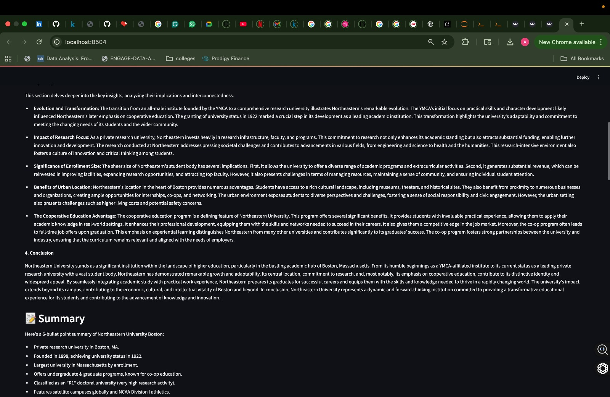
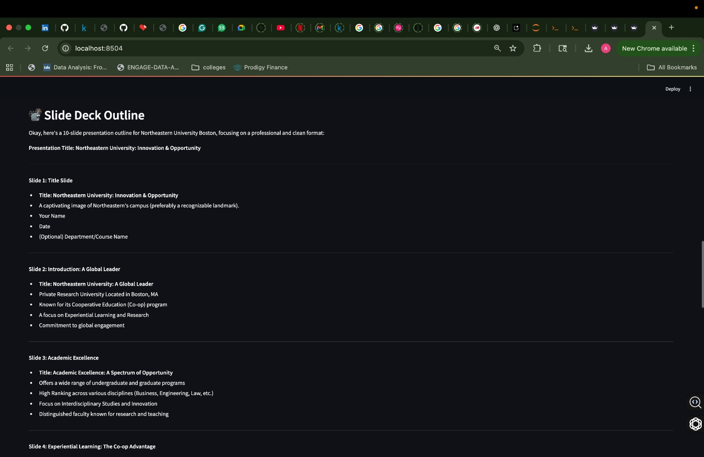
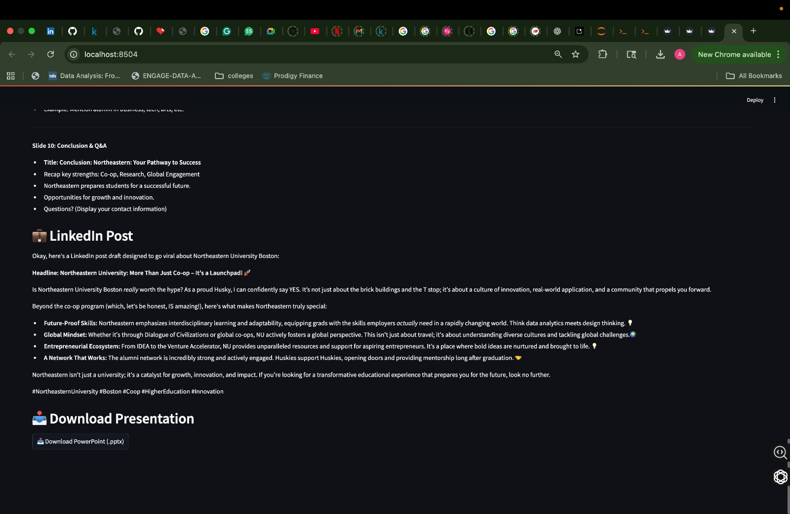
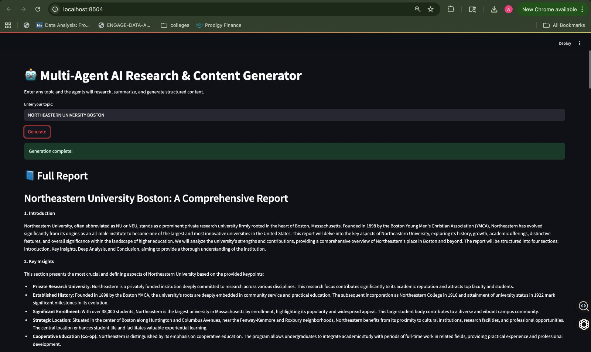

# CAPSTONE_PROJECT
# 🤖 Multi-Agent AI Research & Content Generation System
Autonomous Researcher + Writer Agents powered by Gemini 2.5 & DDGS Search

📌 Overview

This project is an autonomous multi-agent AI system that can research any topic, extract key insights, summarize information, and automatically generate multiple content formats — including full reports, executive summaries, slide outlines, LinkedIn posts, quizzes, and kid-friendly explanations.

It demonstrates practical use of:

Sequential multi-agent workflows

LLM-powered reasoning with Google Gemini 2.5 Flash

Web search integration via DuckDuckGo Search (DDGS)

Content generation & automation pipelines

Agent orchestration patterns (Supervisor → Researcher → Writer)

This was developed as part of the Google & Kaggle Agents Intensive Capstone Project (2025).

## 🚀 Features
✔ Supervisor Agent

Coordinates workflow

Delegates tasks to Researcher & Writer agents

Returns structured final output

✔ Researcher Agent

Performs live DuckDuckGo web searches

Extracts key insights from retrieved content

Summarizes material using Gemini

Provides clean structured research output + citations

✔ Writer Agent

Generates multiple professional content formats:

📄 Full Technical Report

📝 Executive Summary

🎤 Slide Deck Outline

🔗 LinkedIn Post

🎯 Quiz (Knowledge Check)

✔ End-to-End Autonomous Pipeline

Input → Research → Summaries → Multi-format Output
No manual intervention needed.

## 🧩 System Architecture

## 📦 Installation

Clone the repository:

 git clone <your-repo-url>
 cd CAPSTONE_PROJECT

Create & activate virtual environment:

 python3 -m venv venv
 source venv/bin/activate  # macOS/Linux
 # venv\Scripts\activate    # Windows

Install dependencies:

pip install -r requirements.txt
# or manually:
pip install google-generativeai ddgs streamlit python-pptx python-dotenv

Set your Gemini API key:

Create a .env file in the root folder:

GEMINI_API_KEY=YOUR_ACTUAL_KEY_HERE

⚠️ Important: Without a valid API key, agents will return empty outputs.

##🧠 How It Works (Agent Flow)
Supervisor Agent

Handles input prompts

Manages execution order

Aggregates outputs from sub-agents

Researcher Agent
search_results = ddgs.text(query)
keypoints = extract_keypoints(search_results)
summary = gemini.generate_content(...)

Writer Agent

Uses structured research output to generate:

["full_report", "summary", "slides", "linkedin", "quiz", "kid_friendly"]

Gemini produces professional, formatted outputs

Slides are automatically converted to PowerPoint (.pptx)

▶️ Usage Example
from supervisor_agent import supervisor_agent
import asyncio

result = asyncio.run(supervisor_agent("Future of AI Agents"))

print(result["full_report"])
print(result["short_summary"])
print(result["slides"])
print(result["linkedin"])

Streamlit usage:

streamlit run streamlit_app.py

Outputs:

Full Report

Executive Summary

Slide Deck Outline

LinkedIn Post

Downloadable PowerPoint (.pptx)

##🛠 Tools & Technologies
Component	Purpose
Google Gemini 2.5 Flash	LLM for summarization & content generation
DDGS (DuckDuckGo Search)	Privacy-friendly web search
Python (Colab / Local)	Development & execution
Streamlit	Frontend & interactive UI
python-pptx	Generate PowerPoint slides automatically
Multi-Agent Design Patterns	Sequential workflow automation

##⭐ Example Output Snippets

###6-bullet executive summary

###10-slide presentation outline

###Viral LinkedIn post

###Full research report

##🌟 Why This Project Matters

Demonstrates practical automation of complex workflows

Shows multi-agent coordination in real-world tasks

Illustrates the power of Gemini Flash for professional multi-format content generation

Foundation for enterprise-grade agentic systems

##🚀 Future Enhancements

Add memory / session state for long-term topic tracking

Database logging of research results

Deploy front-end UI (Streamlit / Flask) online

Parallel sub-agents for deeper research

RAG integration for document-level retrieval

Add AI-generated images into slides
